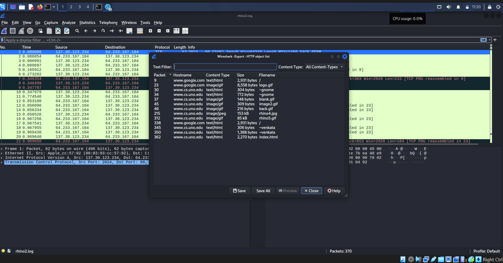

# CIP-B104-CS3-C11_26_DFIT_17300
### Digital Forensics Investigation & Triage - USB + Network

---

### 📌 TABLE OF CONTENTS
1. [Case Overview](#1-case-overview)
2. [Tools Used](#2-tools-used)
3. [Evidence Details](#3-evidence-details)
4. [Investigation Process](#4-investigation-process)
5. [Key Findings](#5-key-findings)
6. [Screenshots](#6-screenshots)
7. [Conclusion](#7-conclusion)

---

### 1. CASE OVERVIEW
This investigation involves forensic analysis of 2 evidence items:
1.  **RHINOUSB** - USB Flash Drive Image - FAT16
2.  **rhino2.pcapng** - Network Traffic Capture

**Case ID:** CIP-B104-CS3-C11_26_DFIT_17300  
**Investigator:** Simon Friday Adeka  
**Date:** 04-05 September 2026  
**Location:** Abuja, Nigeria

---

### 2. TOOLS USED
| Tool | Version | Purpose |
| --- | --- | --- |
| Kali Linux | 2026.2 | Forensic Environment |
| dd | 9.4 | Disk Imaging |
| Sleuth Kit | 4.12 | fsstat, fls, mmls, mactime |
| PhotoRec | 7.2 | Data Carving |
| steghide | 0.5.1 | Steganography Detection |
| Wireshark | 4.2 | Network Analysis |
| sha256sum | 9.4 | Hash Verification |

---

### 3. EVIDENCE DETAILS
| Item | Description | Status |
| --- | --- | --- |
| RHINOUSB.dd | Original USB Image | Acquired |
| rhino2.pcapng | Network Traffic | Acquired |
| f0335017_She_died_in_February_at_the_age_of_74.doc | Recovered Deleted File | Contains Passphrase |
| f0335081.jpg | Steganographic Image | Contains Hidden Data |
| extracted_evidence.txt | Extracted from Stego | Key Evidence |
| rhino4.jpg | Exfiltrated via HTTP | Seen in PCAP |

---

### 4. INVESTIGATION PROCESS

#### 4.1 USB Acquisition & Analysis
`dd` used for imaging. `mmls` showed 1 FAT16 partition. `fls` found deleted files.
PhotoRec recovered `f0335017.doc` and `f0335081.jpg`.

#### 4.2 Steganography
Passphrase found in filename: `She died in February at the age of 74`
Command: `steghide extract -sf f0335081.jpg -p "She died in February at the age of 74"`

#### 4.3 Network Analysis
Wireshark filter: `http.request or http.response`
Identified exfiltration: `137.30.123.234` -> `64.233.167.104`
File: `rhino4.jpg` at `0.346499s`

---

### 5. KEY FINDINGS
1.  **USB FS:** FAT16, 1 Partition
2.  **Deleted File:** `f0335017_She_died_in_February_at_the_age_of_74.doc`
3.  **Stego File:** `f0335081.jpg` with hidden text
4.  **Passphrase:** `She died in February at the age of 74`
5.  **Extracted:** References to August 2001
6.  **Network Exfil:** `137.30.123.234` -> `64.233.167.104` HTTP GET /rhino4.jpg
7.  **Exfil Time:** 0.346499 seconds

---

### 6. SCREENSHOTS

#### 6.1 USB Analysis
**Screenshot 1: mmls Partition**  

**Screenshot 2: Deleted Files**  

**Screenshot 3: PhotoRec**  

#### 6.2 Network Analysis
**Screenshot 4: HTTP Session**  

*Wireshark showing HTTP traffic between 137.30.123.234 and 64.233.167.104*

**Screenshot 5: Data Exfiltration**  

*GET /rhino4.jpg at 0.346499 seconds*

#### 6.3 Steganography
**Screenshot 6: Stego Extraction**  

**Screenshot 7: Extracted Evidence**  

#### 6.4 Hashing
**Screenshot 8: Evidence Hashes**  

| File Name | SHA256 |
| --- | --- |
| f0335017_She_died_in_February_at_the_age_of_74.doc | 95c06c8815cf4bc368a005b94958e34933720648351134929d9fbf7fe2100629 |
| extracted_evidence.txt | 2545063f0580a80936bd999b60b683d66e565c0004f84b28e9740afaaa87ae5b |

---

### 7. CONCLUSION
Investigation completed following DFIT standards.  
**USB:** Steganographic data extracted using passphrase from deleted document.  
**NETWORK:** Confirmed HTTP data exfiltration of rhino4.jpg to 64.233.167.104.  
Chain of custody maintained. All evidence documented.

**Full Report:** `02_Reports/final_executive_report.txt`

---
© 2026 Simon Friday Adeka
