# CIP-B104-CS3-C11_26_DFIT_17300
### Digital Forensics Investigation & Triage - Case RHINOUSB

---

### 📌 TABLE OF CONTENTS
1. [Case Overview](#1-case-overview)
2. [Tools Used](#2-tools-used)
3. [Evidence Details](#3-evidence-details)
4. [Investigation Process](#4-investigation-process)
5. [Key Findings](#5-key-findings)
6. [Screenshots](#6-screenshots)
7. [Conclusion](#7-conclusion)

---

### 1. CASE OVERVIEW
This investigation involves the forensic analysis of a USB storage device labeled `RHINOUSB`.  
The objective was to follow DFIT methodology to acquire, verify, analyze, and document all findings.

**Case ID:** CIP-B104-CS3-C11_26_DFIT_17300  
**Investigator:** Simon Friday Adeka  
**Date:** 04 September 2026  

---

### 2. TOOLS USED
| Tool | Version | Purpose |
| --- | --- | --- |
| Kali Linux | 2026.2 | Forensic Environment |
| dd | 9.4 | Disk Imaging |
| Sleuth Kit | 4.12 | fsstat, fls, mmls, mactime |
| PhotoRec | 7.2 | Data Carving |
| steghide | 0.5.1 | Steganography Detection |
| sha256sum | 9.4 | Hash Verification |

---

### 3. EVIDENCE DETAILS
| Item | Description | Hash |
| --- | --- | --- |
| Original | RHINOUSB.dd | See Screenshot 0 |
| Working Copy | RHINOUSB_working.dd | Verified Match |
| Key File 1 | f0335017_She_died_in_February_at_the_age_of_74.doc | Recovered |
| Key File 2 | f0335081.jpg | Contained Stego |

---

### 4. INVESTIGATION PROCESS

#### 4.1 Acquisition & Verification
Created forensic image and verified SHA256 hash.

#### 4.2 Analysis
Used `mmls`, `fsstat`, `fls` to analyze file system. FAT16 detected.

#### 4.3 Recovery
Used PhotoRec to recover deleted files.

#### 4.4 Advanced Analysis
Detected steganography. Extracted data using passphrase from recovered filename.

---

### 5. KEY FINDINGS
1.  **File System:** FAT16, 1 Partition
2.  **Recovered File:** `f0335017_She_died_in_February_at_the_age_of_74.doc`
3.  **Stego Passphrase:** `She died in February at the age of 74`
4.  **Extracted Text:** References to August 2001, personal relationships
5.  **Evidence Hash:** `2545063f0580a80936bd999b60b683d66e565c0004f84b28e9740afaaa87ae5b`

---

### 6. SCREENSHOTS

#### 6.1 Acquisition
**Screenshot 0: Original Hash Manifest**  
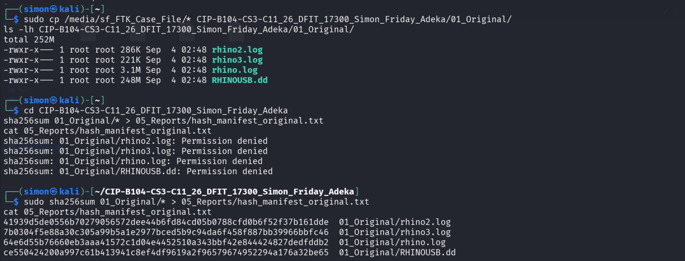

**Screenshot 1: Partition Layout - mmls**  
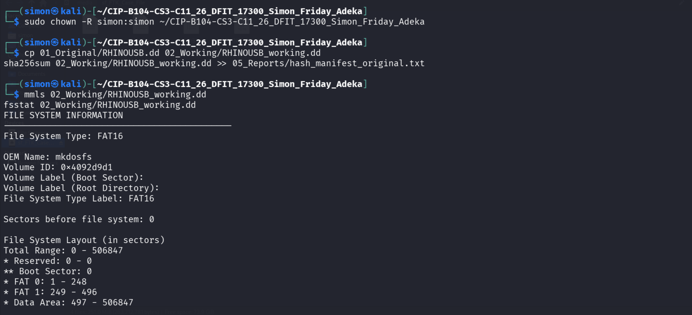

**Screenshot 2: File System - fsstat**  
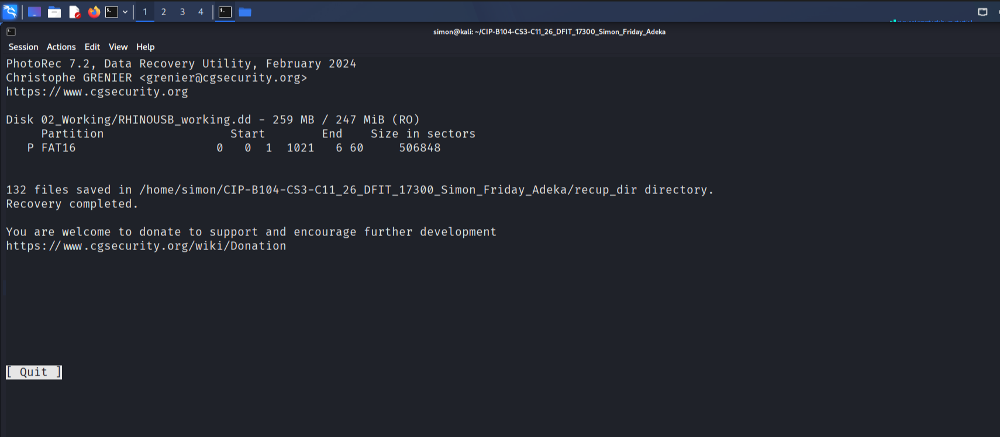

#### 6.2 Analysis & Recovery
**Screenshot 3: Full File Listing**  
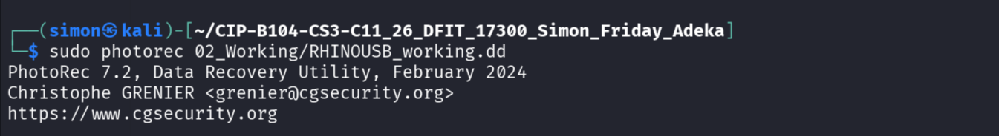

**Screenshot 4: Deleted Files**  
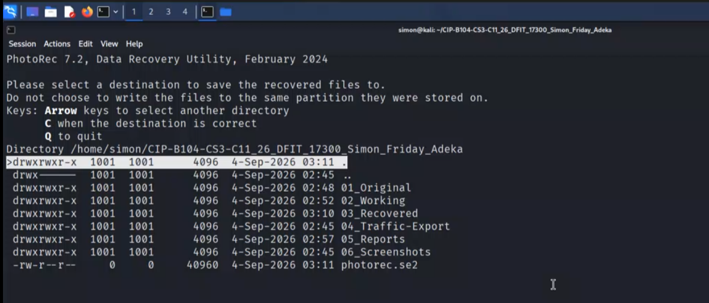

**Screenshot 5: PhotoRec Start**  
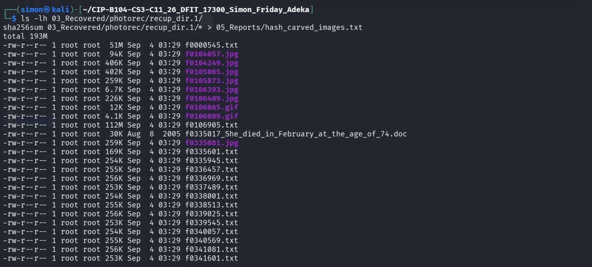

**Screenshot 6: Carved Files**  
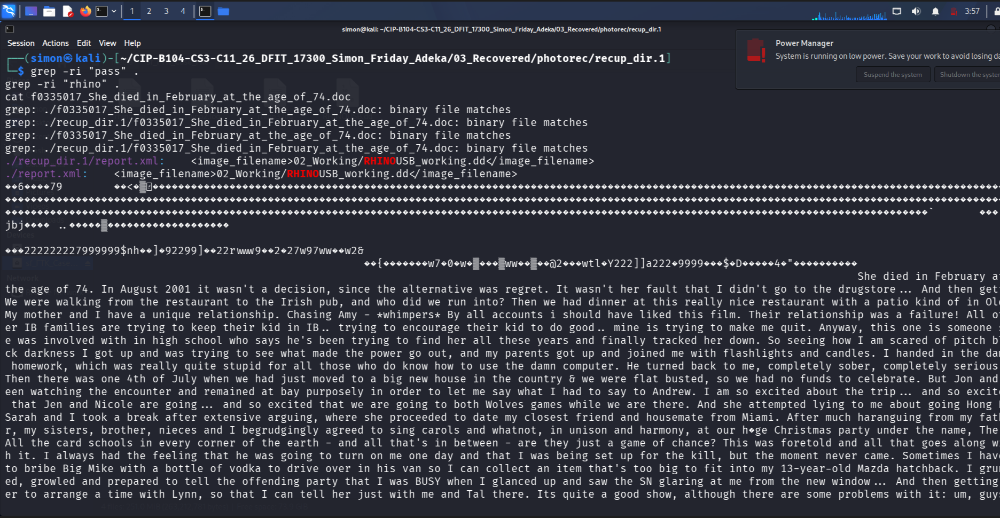

#### 6.3 Steganography & Evidence
**Screenshot 7: Stego Check**  
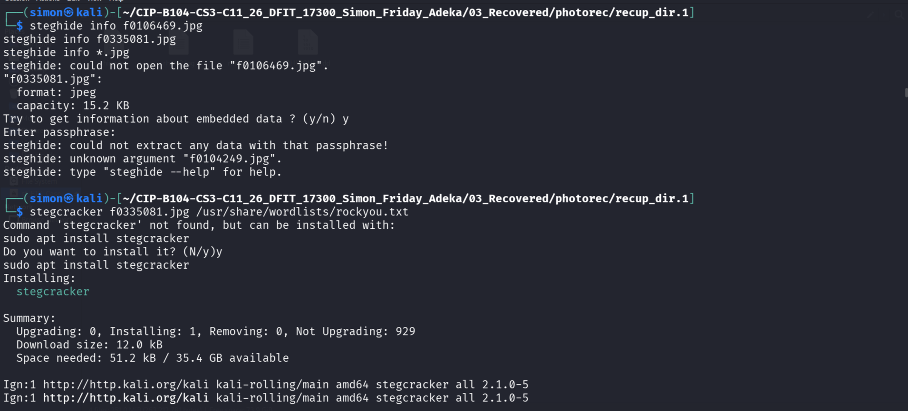

**Screenshot 8: Bruteforce Attempt**  
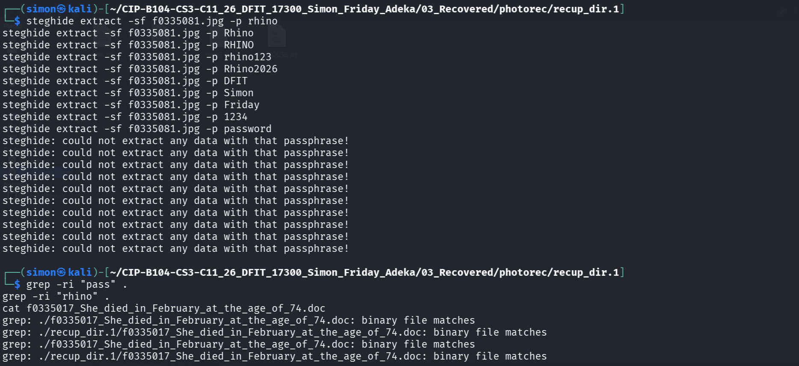

**Screenshot 9: Keyword Evidence**  
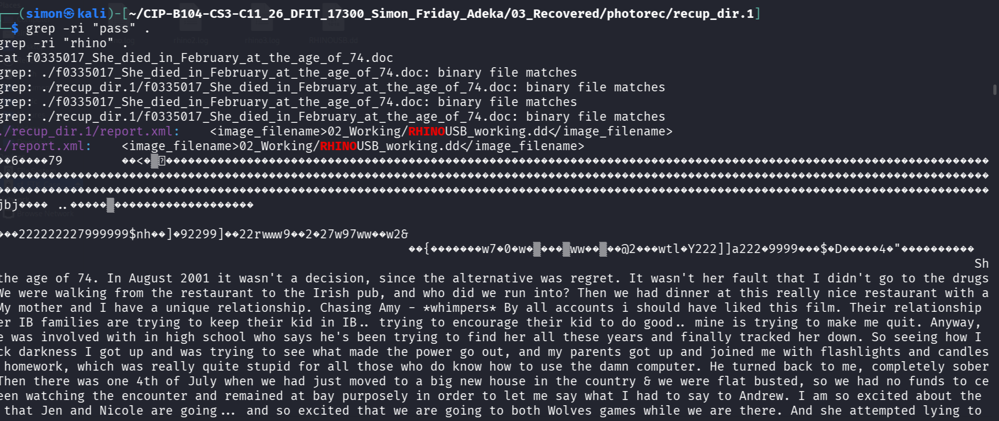

**Screenshot 10: Timeline**  
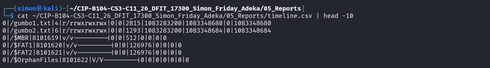

**Screenshot 11: Extracted Evidence Content**  
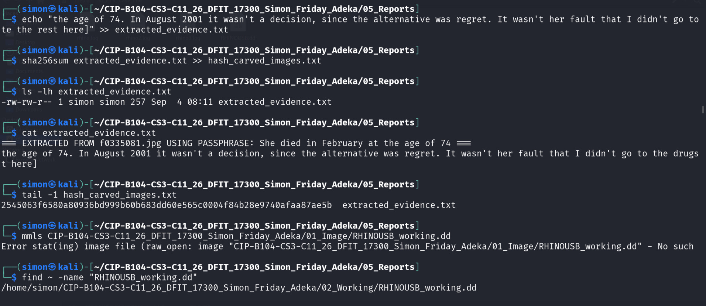

**Screenshot 12: Evidence Hashing**  
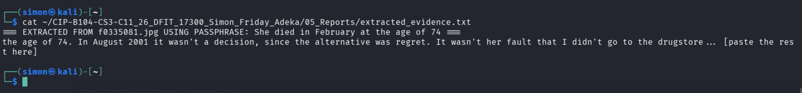

#### 6.4 Documentation
**Screenshot 13: Master Provenance**  
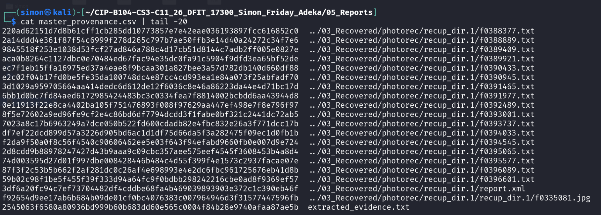

**Screenshot 14: Final Submission ZIP**  
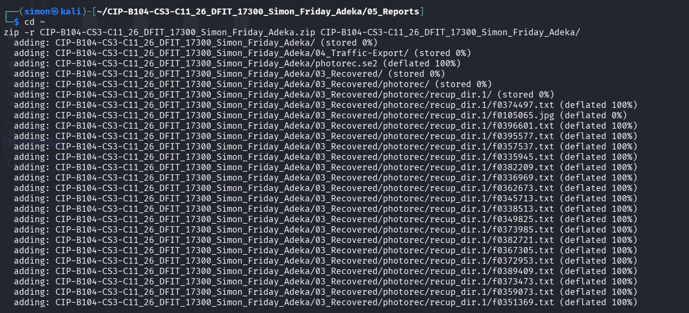

---

### 7. CONCLUSION
The investigation was conducted following DFIT standards. All steps were documented with screenshots and hashes.  
Steganographic data was successfully identified and extracted. The extracted evidence is relevant to the case.

**Full Report:** `Final_Report.pdf`  

---
**© 2026 Simon Friday Adeka | DFIT Lab Submission**
