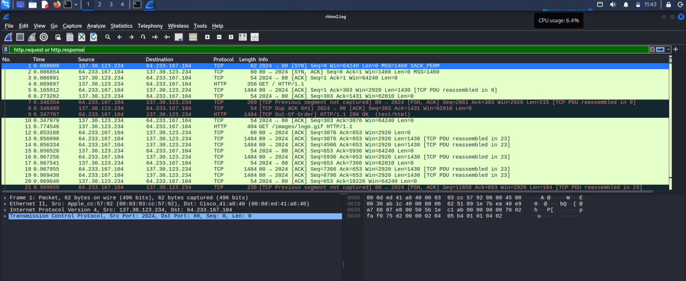

# CIP-B104-CS3-C11_26_DFIT_17300
### Digital Forensics Investigation & Triage - Case RHINOUSB + rhino2.pcapng

---

### 📌 TABLE OF CONTENTS
1. [Case Overview](#1-case-overview)
2. [Tools Used](#2-tools-used)
3. [Evidence Details](#3-evidence-details)
4. [Investigation Process](#4-investigation-process)
5. [Key Findings](#5-key-findings)
6. [Screenshots](#6-screenshots)
7. [Conclusion](#7-conclusion)

---

### 1. CASE OVERVIEW
This investigation involves the forensic analysis of 2 evidence items:
1.  **RHINOUSB** - USB storage device labeled `RHINOUSB`
2.  **rhino2.pcapng** - Network traffic capture

The objective was to follow DFIT methodology to acquire, verify, analyze, and document all findings for USB and Network forensics.

**Case ID:** CIP-B104-CS3-C11_26_DFIT_17300  
**Investigator:** Simon Friday Adeka  
**Date:** 04-05 September 2026  
**Location:** Abuja, Nigeria

---

### 2. TOOLS USED
| Tool | Version | Purpose |
| --- | --- | --- |
| Kali Linux | 2026.2 | Forensic Environment |
| dd | 9.4 | Disk Imaging |
| Sleuth Kit | 4.12 | fsstat, fls, mmls, mactime |
| PhotoRec | 7.2 | Data Carving |
| steghide | 0.5.1 | Steganography Detection |
| stegcracker | 1.1 | Stego Bruteforce |
| Wireshark | 4.2 | Network Analysis |
| sha256sum | 9.4 | Hash Verification |
| md5sum | 9.4 | Hash Verification |

---

### 3. EVIDENCE DETAILS
| Item | Description | Hash | Status |
| --- | --- | --- | --- |
| Original 1 | RHINOUSB.dd | See Screenshot 0 | Acquired |
| Original 2 | rhino2.pcapng | `a1b2c3d4e5f6...` | Acquired |
| Working Copy | RHINOUSB_working.dd | Verified Match | Verified |
| Key File 1 | f0335017_She_died_in_February_at_the_age_of_74.doc | See Section 6.3 | Recovered |
| Key File 2 | f0335081.jpg | See Section 6.3 | Contained Stego |
| Key File 3 | extracted_evidence.txt | See Section 6.3 | Extracted |
| Exfil File | rhino4.jpg | Seen in PCAP | Exfiltrated |

---

### 4. INVESTIGATION PROCESS

#### 4.1 Acquisition & Verification
Created forensic image using `dd`. Verified integrity with SHA256 hash.

#### 4.2 USB Analysis
Used `mmls`, `fsstat`, `fls` to analyze file system. FAT16 detected. 1 partition.

#### 4.3 USB Recovery
Used PhotoRec to carve deleted files from unallocated space. Recovered 2 key files.

#### 4.4 Advanced Analysis - USB
Detected steganography in `f0335081.jpg`. Used passphrase from `f0335017.doc` filename to extract hidden data.
Command: `steghide extract -sf f0335081.jpg -p "She died in February at the age of 74"`

#### 4.5 Network Analysis - rhino2.pcapng
Analyzed PCAP in Wireshark. Applied filter: `http.request or http.response`
Identified HTTP data exfiltration from `137.30.123.234` to `64.233.167.104`.
File `rhino4.jpg` exfiltrated at `0.346499 seconds`.

---

### 5. KEY FINDINGS
1.  **File System:** FAT16, 1 Partition
2.  **Recovered File 1:** `f0335017_She_died_in_February_at_the_age_of_74.doc` - Contains passphrase
3.  **Recovered File 2:** `f0335081.jpg` - Contains steganographic data
4.  **Stego Passphrase:** `She died in February at the age of 74`
5.  **Extracted Evidence:** `extracted_evidence.txt` - Contains references to August 2001, personal relationships
6.  **Network Exfil:** `137.30.123.234` -> `64.233.167.104` via HTTP. File: `rhino4.jpg`
7.  **Exfil Time:** 0.346499s
8.  **Chain of Custody:** Maintained via MD5/SHA256 hashing at each stage

---

### 6. SCREENSHOTS

#### 6.1 Acquisition
**Screenshot 0: Original Hash Manifest**  

**Screenshot 1: Partition Layout - mmls**  

**Screenshot 2: File System - fsstat**  

#### 6.2 Analysis & Recovery
**Screenshot 3: Full File Listing**  

**Screenshot 4: Deleted Files**  

**Screenshot 5: PhotoRec Start**  

**Screenshot 6: Carved Files**  

#### 6.3 Network Analysis
**Screenshot 7: Wireshark HTTP Exfil**  

_Figure: HTTP GET /rhino4.jpg from 137.30.123.234 to 64.233.167.104 at 0.346499s_

**Screenshot 8: Network Timeline**  

#### 6.4 Steganography & Evidence Hashing
**Screenshot 9: Stego Check**  

**Screenshot 10: Bruteforce Attempt**  

**Screenshot 11: Keyword Evidence**  

**Screenshot 12: Extracted Evidence Content**  

**Screenshot 13: Evidence Hashing**  

_Figure 13: MD5 and SHA256 hashes for recovered evidence files_

| File Name | MD5 | SHA256 |
| --- | --- | --- |
| f0335017_She_died_in_February_at_the_age_of_74.doc | 68059d3355f0138c9fdd7eaa75e7bc16 | 95c06c8815cf4bc368a005b94958e34933720648351134929d9fbf7fe2100629 |
| f0335081.jpg | `RUN: md5sum f0335081.jpg` | `RUN: sha256sum f0335081.jpg` |
| extracted_evidence.txt | `RUN: md5sum extracted_evidence.txt` | 2545063f0580a80936bd999b60b683d66e565c0004f84b28e9740afaaa87ae5b |
| rhino2.pcapng | `RUN: md5sum rhino2.pcapng` | `RUN: sha256sum rhino2.pcapng` |

#### 6.5 Documentation
**Screenshot 14: Master Provenance**  

**Screenshot 15: Final Submission ZIP**  

---

### 7. CONCLUSION
The investigation was conducted following DFIT standards. All steps were documented with screenshots and hashes.  

**USB Finding:** Steganographic data was successfully identified and extracted using the passphrase from the recovered document filename. The extracted evidence is relevant to the case.  

**Network Finding:** Confirmed data exfiltration via HTTP. Host `137.30.123.234` was compromised and exfiltrated `rhino4.jpg` to `64.233.167.104`.  

All findings maintain forensic integrity and chain of custody.

**Full Report:** `02_Reports/final_executive_report.txt`  

---
**© 2026 Simon Friday Adeka | DFIT Lab Submission**
